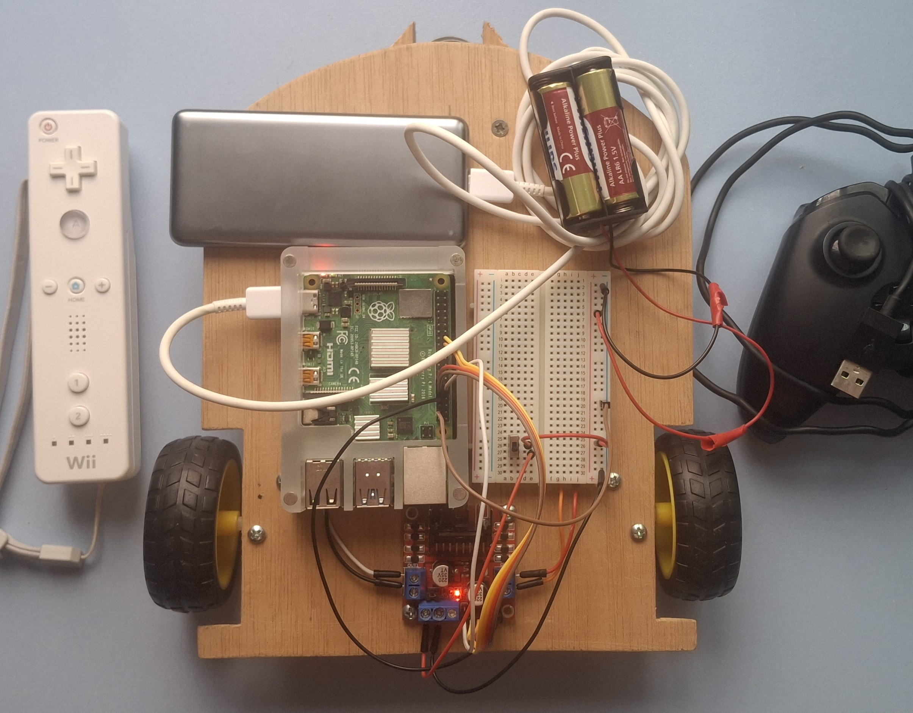

# RCar
Schematic and code for an RC car controlled by Raspberry Pi 4 with remote controls.



---

## How to use it
Raspberry Pi system Debian GNU/Linux 13 (trixie) by default.
And car circuit scheme as in [construction.md](docs/construction.md).

```
# Clone project
git clone https://github.com/JavideSs/RCar.git
cd RCar

# Init project
sudo sh init.sh

# Run RCar
python main.py
```

### Usage

Controlled by Wiimote or Xbox One wired controller according to the commands explained in the help for each controller.

---

## Dependencies
- Refers to the environment initialization script [init.sh](init.sh), where:
  - Python (3.13) >= 3.*
  - cwiid
  - evdev

---

## Feedback
Your feedback is most welcomed by filling a
[new issue](https://github.com/JavideSs/RCar/issues/new).

---

Author:  
Javier Mellado Sánchez  
2020, 2026